# Migrating BTP Neo Java Applications
[](https://api.reuse.software/info/github.com/SAP-samples/btp-java-migration-procedure-united)

## Description
This is a simple example of a Java project that can be used as a supporting resource for understanding Java applications' migration from SAP BTP Neo to SAP BTP Cloud Foundry.

## Contents
1. [Description](#description)
2. [Contents](#contents)
3. [Requirements](#requirements)
4. [Scenario](#scenario)
5. [Project Structure](#project-structure)
6. [SAP BTP Neo Deployment](#sap-btp-neo-deployment)
7. [Migration](#migration)
8. [Step 1. Neo Java Web API to SAP Cloud SDK](#step-1-neo-java-web-api-to-sap-cloud-sdk)
9. [Step 2. Approuter](#step-2-approuter)
10. [Step 3. Authentication and authorization](#step-3-authentication-and-authorization)
11. [Step 4. Destinations](#step-4-destinations)
12. [Step 5. Connectivity](#step-5-connectivity)
13. [Step 6. Document Management Service (ECM)](#step-6-document-management-service)
14. [Step 7. Database](#step-7-database)
15. [Step 8. SAP BTP CF Deployment](#step-8-sap-btp-cf-deployment)
16. [Known issues](#known-issues)
17. [How to obtain support](#how-to-obtain-support)
18. [Contributing](#contributing)

## Requirements
You have installed the following tools to be able to perform the steps described in this document:
1. SAP JVM 8: [installation](https://help.sap.com/docs/btp/sap-btp-neo-environment/optional-install-sap-jvm)
2. Maven: [installation](https://maven.apache.org/install.html)
3. CF CLI: [installation](https://docs.cloudfoundry.org/cf-cli/install-go-cli.html)
4. MultiApps CloudFoundry CLI Plugin: [installation](https://developers.sap.com/tutorials/cp-cf-install-cliplugin-mta.html)
5. IDE of your choice (for example, IntelliJ IDEA, Eclipse)
6. SAP BTP Neo subaccount (with created SAP Hana database)
7. SAP BTP Cloud Foundry subaccount (with created SAP Hana database)
8. (Optional) Local tomcat 8.5.X to run OnPremise application: [installation](https://tomcat.apache.org/download-80.cgi)
9. Node.js and npm. Please refer to the official [documentation](https://docs.npmjs.com/downloading-and-installing-node-js-and-npm) to check the installation process.

### Scenario


The first app manages Personnel entities in the HANA database. The second app stores files in the document service and provides a REST API for managing files and a user interface.<br>

The first app has a UI that creates a person with a first name, second name, and a photo. To store the photo, the first app uses a REST API of the second app to store the person's photo as a document. For that purpose, there must be "trust" between the two apps.<br>

Each app should be able to work alone - i.e. even if the document storage app is not there, the person app should be able to store a person without a photo, and the document app should be able to work alone.<br>

### Project Structure
**scenario/**<br>
|--**on-premise-demo** - sources of OnPremise demo application<br>
|--**neo/**<br>
&nbsp;&nbsp;&nbsp;|--**application1/** - sources of Java app 1 for SAP BTP Neo<br>
&nbsp;&nbsp;&nbsp;&nbsp;&nbsp;&nbsp;|-- ...<br>
&nbsp;&nbsp;&nbsp;|--**application2/** - sources of Java app 2 for SAP BTP Neo<br>
&nbsp;&nbsp;&nbsp;&nbsp;&nbsp;&nbsp;|-- ...<br>
|--**cf/**<br>
&nbsp;&nbsp;&nbsp;|--**cf-application1/** - sources of migrated Java app 1 for SAP BTP CloudFoundry<br>
&nbsp;&nbsp;&nbsp;&nbsp;&nbsp;&nbsp;|--**approuter/** - sources of approuter application<br>
&nbsp;&nbsp;&nbsp;&nbsp;&nbsp;&nbsp;&nbsp;&nbsp;&nbsp;|--**xs-app.json** - approuter configuration<br>
&nbsp;&nbsp;&nbsp;&nbsp;&nbsp;&nbsp;|--**mta.yaml** - deployment descriptor<br>
&nbsp;&nbsp;&nbsp;&nbsp;&nbsp;&nbsp;|--**xs-security.json** - security descriptor<br>
&nbsp;&nbsp;&nbsp;&nbsp;&nbsp;&nbsp;|-- ...<br>
&nbsp;&nbsp;&nbsp;|--**cf-application2/** - sources of migrated Java app 2 for SAP BTP CloudFoundry<br>
&nbsp;&nbsp;&nbsp;&nbsp;&nbsp;&nbsp;|--**approuter/** - sources of approuter application<br>
&nbsp;&nbsp;&nbsp;&nbsp;&nbsp;&nbsp;&nbsp;&nbsp;&nbsp;|--**xs-app.json** - approuter configuration<br>
&nbsp;&nbsp;&nbsp;&nbsp;&nbsp;&nbsp;|--**mta.yaml** - deployment descriptor<br>
&nbsp;&nbsp;&nbsp;&nbsp;&nbsp;&nbsp;|--**xs-security.json** - security descriptor<br>
&nbsp;&nbsp;&nbsp;&nbsp;&nbsp;&nbsp;|-- ...<br>

## SAP BTP Neo Deployment

### Option 1. Via SAP BTP Cockpit

To build and deploy this scenario in SAP BTP Neo, you need to do following:

1. Clone/download this repository.<br>
2. Go to the `scenario/neo` directory.<br>
3. Go to `application1` and execute the `mvn clean package` command from the terminal. Repeat the steps for `application2`.

4. Go to the SAP BTP Neo subaccount -> Java Applications. Choose `Deploy Application` and provide the location of the `*.war` file for each application.

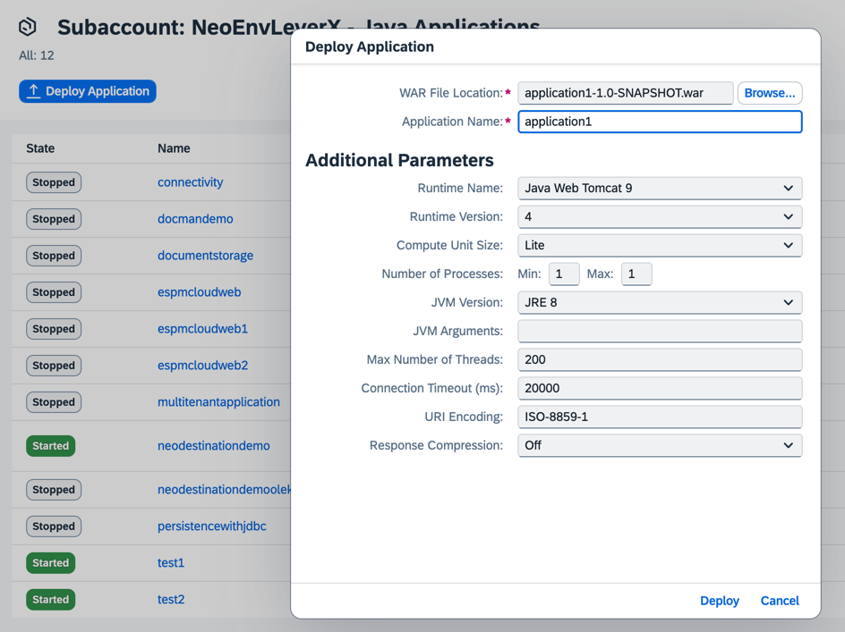

5. Choose `Deploy`.

> Note: please do not start the applications yet.

### Option 2. Via Neo CLI

1. Clone/download this repository.<br>
2. Go to the `scenario/neo` directory.<br>
3. Go to `application1` and execute the `mvn clean package` command from terminal. Repeat the steps for `application2`.

> Note: Install Neo CLI if not installed yet. [Installation](https://help.sap.com/docs/btp/sap-btp-neo-environment/install-sap-btp-sdk-for-neo-environment?locale=en-US)

4. Execute the following command for `application1` and `application2`:<br>
```shell
neo.sh deploy --account <subaccount technical name> --application <application name> --source <path to war file> --user <user name or email> --host <host>
```

> Note: Neo CLI provides `neo.sh` and `neo.bat` for UNIX systems and Windows respectively. You can find them in `<Neo CLI directory>/tools`.<br>
>
> Note: See [here](https://help.sap.com/docs/btp/sap-btp-neo-environment/regions-and-hosts-available-for-neo-environment) for the host for the subaccount<br>
>
> Note: Get the subaccount technical name from the SAP BTP Neo subaccount overview page:<br>
> 


Useful links:
- [Using Neo CLI](https://help.sap.com/docs/btp/sap-btp-neo-environment/using-console-client)

#### SAP BTP Neo applications configuration

Go the SAP Hana Workbench and create a new user for the data source binding:
1. Go to `SAP HANA/SAP ASE`, choose `Databases & Schemas` and click on the database you have:<br>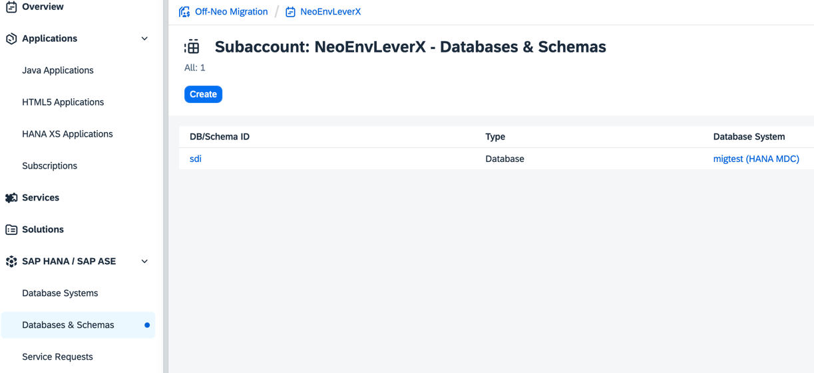<br>
2. Click `SAP HANA Web-Based Development Workbench`:<br>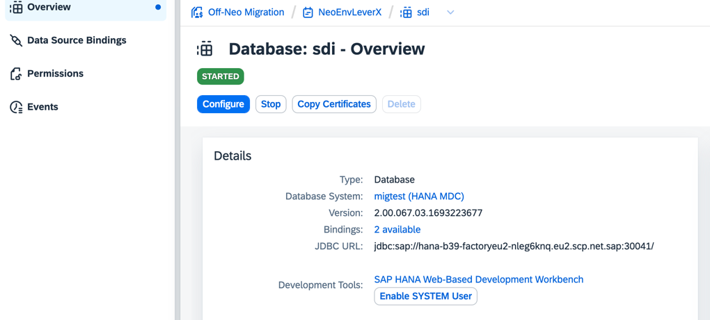<br>
3. Click on the `Catalog` tile.
4. Open a new SQL console and create a new user by executing the following SQL statement:
```sql
CREATE USER <username> PASSWORD <password> NO FORCE_FIRST_PASSWORD_CHANGE;
```
Example:<br>

5. Go to the deployed **application1**.

6. Open the `Configuration` tab -> `Data Source Bindings` and provide the required details:
    - Data Source field: `jdbc/application1`
    - DB/Schema ID
    - Database User and password (the newly created user credentials).

7. Choose `Create`.

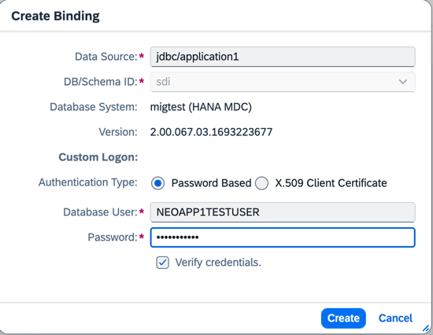

8. Go to the deployed **application2** and start it.

9. Go back to the deployed **application1** and open the `Configuration` tab -> `Destinations`.

10. Click `New Destination` and provide the required details:
- Name: application2-destination
- Type: HTTP
- URL: Enter the url of the started **application2**
- Proxy Type: Internet
- Authentication: AppToAppSSO

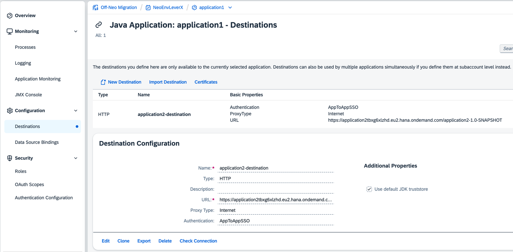

11. Start **application1**.


#### SAP BTP Neo UI Deployment

You can use a sample SAPUI5 application to trigger Java endpoints in a user-friendly environment.
Follow the steps below to deploy the SAPUI5 application to the SAP BTP Neo cockpit and connect it to the Java application.
1. Choose HTML5 Applications in the left navigation panel.
   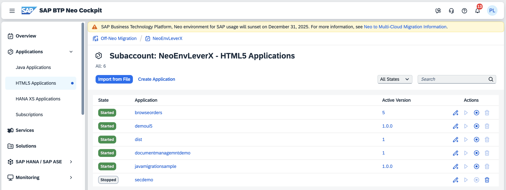

2. Choose "Import from file" to create an application and provide the required details:
- Download the [zip](./scenario/neo/employeelistui/dist.zip) file to your local machine and provide a path to the archive in the "Zip File" field.
- Application name
- Application version

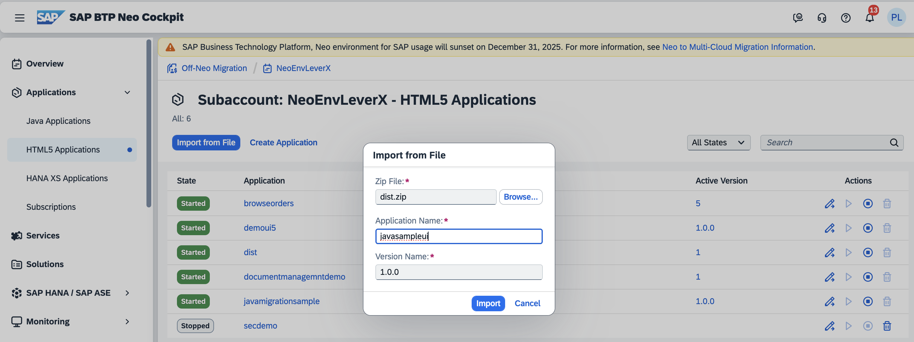

3. Select a new application in the list and open its details page.


4. Choose "Versioning" -> "Versions" to activate a new version.

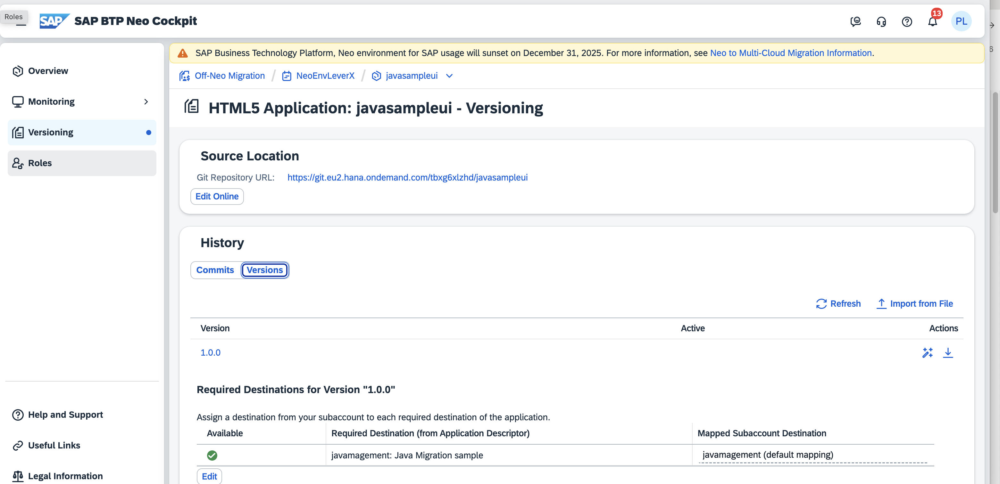

5. Choose "Activate version" and confirm the activation in a popup.

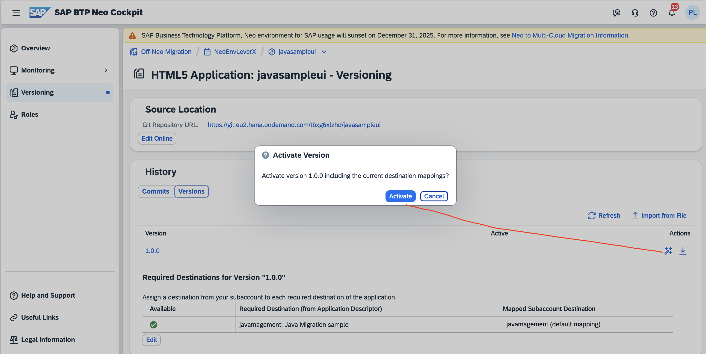

6. Go back to the app overview page. Verify that the application is started and copy the application link.


7. Go to Connectivity/Destinations and create a new destination to connect the SAPUI5 application to the Java application.
    - Name: javamagement
    - Type: HTTP
    - URL: Enter the url of the started **application1**
    - ProxyType: Internet
    - Authentication: AppToAppSSO

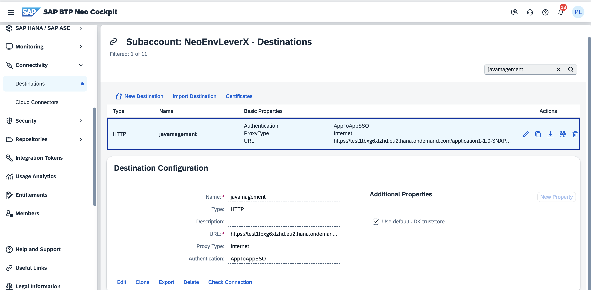

8. Open the SAPUI5 application using a link taken from the application overview page (see step 6).

## Migration

This is a guide on how to migrate scenario applications from SAP BTP Neo to SAP BTP Cloud Foundry. You can find already migrated applications in the `scenario/cf/` directory.

To try this migration yourself, copy the content in the `scenario/neo/` directory to another directory of your choice (e.g. `migration/`) and follow the next steps.

### Step 1. Neo Java Web API to SAP Cloud SDK
The Neo Java Web API dependency is not provided in Cloud Foundry. Comment out the following lines in `migration/application1/pom.xml` and `migration/application2/pom.xml`:<br>
:x:
```xml
<dependency>
    <groupId>com.sap.cloud</groupId>
    <artifactId>neo-java-web-api</artifactId>
    <version>${neo-java-web-api-version}</version>
    <scope>provided</scope>
</dependency>
```
You can use the SAP Cloud SDK to interact with services:<br>
> Note: sdk-modules-bom - Bill of Materials (BOM) of the SAP Cloud SDK modules<br>
> Note: cf-tomcat-bom - Versions control of CF Tomcat BOM<br>

:white_check_mark:
```xml
<dependencyManagement>
   <dependency>
      <groupId>com.sap.cloud.sjb.cf</groupId>
      <artifactId>cf-tomcat-bom</artifactId>
      <version>${cf-tomcat-bom-version}</version>
      <type>pom</type>
      <scope>import</scope>
   </dependency>
    <dependency>
        <groupId>com.sap.cloud.sdk</groupId>
        <artifactId>sdk-modules-bom</artifactId>
        <version>${sdk-modules-bom-version}</version>
        <type>pom</type>
        <scope>import</scope>
    </dependency>
</dependencyManagement>

<dependencies>
    <dependency>
        <groupId>com.sap.cloud.sdk.cloudplatform</groupId>
        <artifactId>scp-cf</artifactId>
    </dependency>
    ...
</dependencies>
```

As the Neo Java Web API is not provided in the SAP BTP Cloud Foundry environment, you need to **comment out** all Neo-related `<resource-ref>` from `migration/application1` and `migration/application2`.
They are located in `WEB-INF/web.xml`. The following are available:<br>
:x:
```xml
<resource-ref>
    <res-ref-name>jdbc/application1</res-ref-name>
    <res-type>javax.sql.DataSource</res-type>
</resource-ref>

<resource-ref>
    <res-ref-name>connectivityConfiguration</res-ref-name>
    <res-type>com.sap.core.connectivity.api.configuration.ConnectivityConfiguration</res-type>
</resource-ref>

<resource-ref>
    <res-ref-name>authenticationHeaderProvider</res-ref-name>
    <res-type>com.sap.core.connectivity.api.authentication.AuthenticationHeaderProvider</res-type>
</resource-ref>
```

Useful links:
- SAP Cloud SDK for Java - [documentation](https://sap.github.io/cloud-sdk/docs/java/overview-cloud-sdk-for-java)
- Bill Of Materials - [documentation](https://help.sap.com/docs/btp/sap-business-technology-platform/bill-of-materials-bom)

### Step 2. Approuter
If your application interacts with the user (e.g. use template engines or serves static files like *.html), you need to use approuter which will act as a gateway which will trigger authentication.<br>

Start by creating a new directory with the name `approuter` in the `migration/application1` and `migration/application2` directories. Create `package.json` and `xs-app.json` files inside the `approuter` directory. <br>

`package.json`:
```json
{
  "name": "approuter",
  "dependencies": {
    "@sap/approuter": "^14.1.1"
  },
  "scripts": {
    "start": "node node_modules/@sap/approuter/approuter.js"
  }
}
```
> Note: The version of the approuter can change. Please take this into account during actual migration. See  [NPM](https://www.npmjs.com/package/@sap/approuter).

`xs-app.json`:
```json
{
  "authenticationMethod": "route",
  "routes": [
    {
      "source": "^(/.*)",
      "target": "$1",
      "destination": "cf-java-backend-destination",
      "authenticationType": "xsuaa",
      "csrfProtection": false
    }
  ]
}
```
> Note: Put your name of destination which will be used to proxy requests from approuter to the backend application. You can create this destination in SAP BTP Cockpit or create it with the deployment descriptor. The creation of a destination with the deployment descriptor is described in one of next steps.<br>
> See: [Application Router Configuration Syntax](https://help.sap.com/docs/hana-cloud-database/sap-hana-cloud-sap-hana-database-developer-guide-for-cloud-foundry-multitarget-applications-sap-web-ide-full-stack/application-router-configuration-syntax)

### Step 3. Authentication and authorization
SAP BTP Cloud Foundry uses the XSUAA service instance for authentication and authorization.<br>
To use it, you need to create a service instance and a service binding to your application.<br>

The creation of XSUAA service instance/service binding is done automatically by the `cf deploy` command with Deployment Artifact (Section [Step 7. Deployment](#step-7-deployment)).<br>
We need to create the `xs-security.json` file which is also known as Security Descriptor - configuration file for specifying scopes, role-templates, role-collection etc.

:white_check_mark:<br>
`migration/application1/xs-security.json`:
```json
{
   "xsappname": "cf-application1",
   "tenant-mode": "dedicated",
   "scopes": [
      {
         "name": "$XSAPPNAME.Everyone",
         "description": "Everyone"
      },
      {
         "name": "uaa.user",
         "description": "UAA"
      }
   ],
   "role-templates": [
      {
         "name": "Everyone",
         "scope-references": [
            "$XSAPPNAME.Everyone",
            "uaa.user"
         ]
      }
   ],
   "role-collections": [
      {
         "name": "Everyone_RC",
         "role-template-references": [
            "$XSAPPNAME.Everyone"
         ]
      }
   ]
}
```

:white_check_mark:<br>
`migration/application2/xs-security.json`:
```json
{
   "xsappname": "cf-application2",
   "tenant-mode": "dedicated",
   "scopes": [
      {
         "name": "$XSAPPNAME.Everyone",
         "description": "Everyone"
      }
   ],
   "role-templates": [
      {
         "name": "Everyone",
         "scope-references": [
            "$XSAPPNAME.Everyone"
         ]
      }
   ],
   "role-collections": [
      {
         "name": "Everyone_RC_app2",
         "role-template-references": [
            "$XSAPPNAME.Everyone"
         ]
      }
   ]
}
```


In the `src/main/java/webapp/WEB-INF/web.xml` of the `migration/application1` and `migration/application2` java application, you need to change `<auth-method>` to XSUAA:<br>
:white_check_mark:
```xml
<login-config>
    <auth-method>XSUAA</auth-method>
</login-config>
```

> Note: In SAP BTP Neo all authenticated users implicitly have the `Everyone` role, but that is not the case for SAP BTP Cloud Foundry.

In SAP BTP Neo applications, the `UserManagementAccessor` API was used to retrieve information about the current user.<br>
:x:
```java
public class UserInfoServlet extends HttpServlet {

  public void doGet(HttpServletRequest request, HttpServletResponse response) throws IOException, ServletException {
    if (request.getUserPrincipal() == null) {
      throw new ServletException("User principal is null");
    }

     try {
        // UserProvider provides access to the user storage
        UserProvider users = UserManagementAccessor.getUserProvider();
   
        // Read the currently logged-in user from the user storage
        User user = users.getUser(request.getUserPrincipal().getName());
   
        String username = user.getAttribute("firstname") + " " + user.getAttribute("lastname");
        String email = user.getAttribute("email");
   
        UserDto userDto = new UserDto(username, email);
        String userDtoJson = new ObjectMapper().writeValueAsString(userDto);
   
        response.getWriter().print(userDtoJson);
     } catch (Exception e) {
        LOGGER.error("Exception occurred: " + e.getMessage(), e);
   
        throw new ServletException(e);
     }
  }
}

```

In SAP BTP Cloud Foundry, we will use [cloud-security-services-integration-library](https://github.com/SAP/cloud-security-services-integration-library/tree/main-2.x).
To do that, we need to add the following dependency to pom.xml (both for `migration/application1` and `migration/application2`):<br>

:white_check_mark:
```xml
<dependency>
    <groupId>com.sap.cloud.security</groupId>
    <artifactId>java-api</artifactId>
</dependency>
```

Also, we need to modify a code that is responsible for user data retrieval.<br>
:white_check_mark:
```java
public class UserInfoServlet extends HttpServlet {
  
  public void doGet(HttpServletRequest request, HttpServletResponse response) throws IOException, ServletException {
     Token token = SecurityContext.getAccessToken();
   
     if (token == null) {
        throw new ServletException("Access token is null");
     }
   
     String userName = token.getClaimAsString(TokenClaims.GIVEN_NAME);
     String email = token.getClaimAsString(TokenClaims.EMAIL);
   
     UserDto userDto = new UserDto(userName, email);
   
     String userDtoJson = new ObjectMapper().writeValueAsString(userDto);
   
     // Print the username and email
     response.getWriter().print(userDtoJson);
  }
}
```

Useful links:
- Application Security Descriptor Configuration Syntax - [documentation](https://help.sap.com/docs/btp/sap-business-technology-platform/application-security-descriptor-configuration-syntax)
- SAP BTP Neo Get User Attributes - [documentation](https://help.sap.com/docs/btp/sap-btp-neo-environment/user-attributes)

### Step 4. Destinations
SAP BTP Neo application used ConnectivityConfiguration and AuthenticationHeaderProvider APIs. They should be **commented out** from `migration/application1/src/main/webapp/WEB-INF/web.xml` and `migration/application2/src/main/webapp/WEB-INF/web.xml` in SAP BTP Cloud Foundry:<br>
:x:
```xml
<resource-ref>
    <res-ref-name>connectivityConfiguration</res-ref-name>
    <res-type>com.sap.core.connectivity.api.configuration.ConnectivityConfiguration</res-type>
</resource-ref>

<resource-ref>
    <res-ref-name>authenticationHeaderProvider</res-ref-name>
    <res-type>com.sap.core.connectivity.api.authentication.AuthenticationHeaderProvider</res-type>
</resource-ref>
```

SAP BTP Neo Code for destination usage:<br>
:x:
```java

@MultipartConfig
public class ManagementPageServlet extends HttpServlet {

  private static final Logger LOGGER = LoggerFactory.getLogger(ManagementPageServlet.class);

  private static final String DESTINATION_NAME = "application2-destination";

  private ConnectivityConfiguration connectivityConfiguration;
  private AuthenticationHeaderProvider authenticationHeaderProvider;

  @Override
  public void init() throws ServletException {
    try {
      InitialContext ctx = new InitialContext();

      connectivityConfiguration = (ConnectivityConfiguration) ctx.lookup("java:comp/env/connectivityConfiguration");
      authenticationHeaderProvider = (AuthenticationHeaderProvider) ctx.lookup("java:comp/env/authenticationHeaderProvider");
    } catch (NamingException e) {
      throw new ServletException("Can't lookup resources", e);
    }
  }

  @Override
  protected void doPost(HttpServletRequest request, HttpServletResponse response) throws ServletException, IOException {
    Part file = request.getPart("file");

    DestinationConfiguration destinationConfiguration = connectivityConfiguration.getConfiguration(DESTINATION_NAME);
    String requestUrl = destinationConfiguration.getProperty("URL") + "/api/documents";
    
    AuthenticationHeader apptoAppSSOHeader = authenticationHeaderProvider.getApptoAppSSOHeader(requestUrl,
        destinationConfiguration);

    try (CloseableHttpClient httpClient = HttpClients.createDefault()) {
      URIBuilder builder = new URIBuilder(requestUrl);
      builder.setParameter("caller", "external");
      builder.setParameter("fileName", file.getSubmittedFileName());
      URI uri = builder.build();

      HttpPost httpPost = new HttpPost(uri);
      httpPost.addHeader(apptoAppSSOHeader.getName(), apptoAppSSOHeader.getValue());

      HttpEntity httpEntity = MultipartEntityBuilder.create().addBinaryBody("file", file.getInputStream()).build();

      httpPost.setEntity(httpEntity);

      String documentId = httpClient.execute(httpPost, new BasicResponseHandler()).replaceAll("^\"|\\n$", "");
    } catch (IOException e) {
      LOGGER.error("Can't establish connection with Document Storage application: " + e.getMessage(), e);
    }
    //...
  }
}
```

For SAP BTP Cloud Foundry, the SAP Cloud SDK provides an API to consume destinations created in the SAP BTP Cockpit:<br>
:white_check_mark:
```java
package com.example.application1;

import com.sap.cloud.sdk.cloudplatform.connectivity.HttpDestination;

import static com.sap.cloud.sdk.cloudplatform.connectivity.DestinationAccessor.getDestination;
import static com.sap.cloud.sdk.cloudplatform.connectivity.HttpClientAccessor.getHttpClient;

@MultipartConfig
public class ManagementPageServlet extends HttpServlet {

  private final static Logger LOGGER = LoggerFactory.getLogger(ManagementPageServlet.class);

  private static final String DESTINATION_NAME = "application2-destination";

  @Override
  protected void doPost(HttpServletRequest request, HttpServletResponse response) throws ServletException, IOException {
    Part file = request.getPart("file");

    HttpDestination httpDestination = getDestination(DESTINATION_NAME).asHttp();
    String requestUrl = httpDestination.getUri() + "/api/documents";

    try {
      HttpClient httpClient = getHttpClient(httpDestination);

      URIBuilder builder = new URIBuilder(requestUrl);
      builder.setParameter("caller", "external");
      builder.setParameter("fileName", file.getSubmittedFileName());
      URI uri = builder.build();

      HttpPost httpPost = new HttpPost(uri);

      HttpEntity httpEntity = MultipartEntityBuilder.create().addBinaryBody("file", file.getInputStream()).build();

      httpPost.setEntity(httpEntity);

      String documentId = httpClient.execute(httpPost, new BasicResponseHandler()).replaceAll("^\"|\\n$", "");
    } catch (IOException e) {
      LOGGER.error("Can't establish connection with Document Storage application: " + e.getMessage(), e);
    }
    //...
  }
}
```
### Step 5. Connectivity

the SAP BTP Neo application uses ConnectivityConfiguration and AuthenticationHeaderProvider APIs. They should be **commented out** from `migration/application2/src/main/webapp/WEB-INF/web.xml` in SAP BTP Cloud Foundry:<br>
:x:
```xml
<resource-ref>
    <res-ref-name>connectivityConfiguration</res-ref-name>
    <res-type>com.sap.core.connectivity.api.configuration.ConnectivityConfiguration</res-type>
</resource-ref>

<resource-ref>
    <res-ref-name>authenticationHeaderProvider</res-ref-name>
    <res-type>com.sap.core.connectivity.api.authentication.AuthenticationHeaderProvider</res-type>
</resource-ref>
```

SAP BTP Neo Code for connectivity usage:<br>
:x:
```java
public class OnPremiseServlet extends HttpServlet {

  private static final Logger LOGGER = LoggerFactory.getLogger(OnPremiseServlet.class);

  private static final String DESTINATION_NAME = "on-premise-dest";

  @Resource
  private TenantContext tenantContext;

  private ConnectivityConfiguration connectivityConfiguration;

  @Override
  public void init() {
    try {
      InitialContext ctx = new InitialContext();

      connectivityConfiguration = (ConnectivityConfiguration) ctx.lookup("java:comp/env/connectivityConfiguration");
    } catch (NamingException e) {
      throw new RuntimeException("Can't lookup resources", e);
    }
  }

  @Override
  protected void doGet(HttpServletRequest request, HttpServletResponse response) throws ServletException, IOException {
    String message;
    try {
      DestinationConfiguration destinationConfiguration = connectivityConfiguration.getConfiguration(DESTINATION_NAME);
      String requestUrl = destinationConfiguration.getProperty("URL") + "/hello-servlet";

      String proxyHost = System.getenv("HC_OP_HTTP_PROXY_HOST");
      int proxyPort = Integer.parseInt(System.getenv("HC_OP_HTTP_PROXY_PORT"));

      Proxy proxy = new Proxy(Proxy.Type.HTTP, new InetSocketAddress(proxyHost, proxyPort));

      URL url = new URL(requestUrl);
      HttpURLConnection urlConnection = (HttpURLConnection) url.openConnection(proxy);
      urlConnection.setRequestProperty("SAP-Connectivity-ConsumerAccount", tenantContext.getAccountName());

      try (InputStream inputStream = urlConnection.getInputStream()) {
        message = new BufferedReader(new InputStreamReader(inputStream, StandardCharsets.UTF_8)).lines().collect(Collectors.joining("\n"));
      }
    } catch (Exception e) {
      LOGGER.error("Can't establish connection to OnPremise system", e);

      message = "Can't establish connection to OnPremise system: " + e.getMessage();
    }

    request.setAttribute("message", message);
    request.getRequestDispatcher("/on-premise.jsp").forward(request, response);
  }

}
```

For SAP BTP Cloud Foundry, we can use the SAP Cloud SDK to establish a connection to an OnPremise system with SAP Cloud Connector:<br>

**Destination:**<br>
<br>
**SAP Cloud Connector setup:**<br>
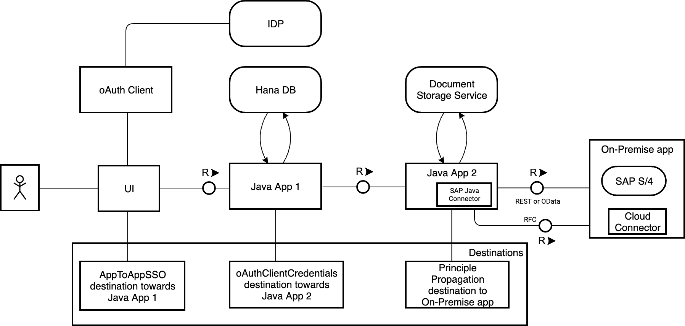<br>
**Code:**<br>
:white_check_mark:
```java
import static com.sap.cloud.sdk.cloudplatform.connectivity.DestinationAccessor.getDestination;
import static com.sap.cloud.sdk.cloudplatform.connectivity.HttpClientAccessor.getHttpClient;

public class OnPremiseServlet extends HttpServlet {

  private static final String DESTINATION_NAME = "on-premise-dest";

  @Override
  protected void doGet(HttpServletRequest request, HttpServletResponse response) throws ServletException, IOException {

    HttpDestination httpDestination = getDestination(DESTINATION_NAME).asHttp();
    String requestUrl = httpDestination.getUri() + "/hello-servlet";

    HttpClient httpClient = getHttpClient(httpDestination);
    HttpGet httpGet = new HttpGet(requestUrl);

    String message = httpClient.execute(httpGet, new BasicResponseHandler());

    request.setAttribute("message", message);

    request.getRequestDispatcher("/on-premise.jsp").forward(request, response);
  }
}

```

SAP Cloud SDK connectivity [documentation](https://sap.github.io/cloud-sdk/docs/java/features/connectivity/on-premise)<br>

#### Run OnPremise demo application
- Option 1. Import it into your IDE and run with tomcat here.
- Option 2. Deploy right into tomcat by copying the `*.war` file into the `webapps` directory.

### Step 6. Document Management Service

**Comment out** the following lines from `migration/application2/webapp/WEB-INF/web.xml`:<br>
:x:
```xml
<resource-ref>
    <res-ref-name>EcmService</res-ref-name>
    <res-type>com.sap.ecm.api.EcmService</res-type>
</resource-ref>
```

For SAP BTP Cloud Foundry, the main difference is in **retrieval of opencmis session.**<br>
SAP BTP Neo opencmis session retrieval (full code [here](./scenario/neo/application2/src/main/java/com/example/application2/ecm/EcmManager.java)):<br>
:x:
```java
package com.example.application2.ecm;

import com.sap.ecm.api.EcmService;
import com.sap.ecm.api.RepositoryOptions;
import org.apache.chemistry.opencmis.client.api.Session;
import org.apache.chemistry.opencmis.commons.exceptions.CmisObjectNotFoundException;

import javax.naming.InitialContext;
import javax.naming.NamingException;

public class EcmManager {
  private static final String UNIQUE_NAME = "test_repository";
  private static final String SECRET_KEY = "test_repository_secret_key";

   public Session getSession() {
      Session session;
      try {
         // connect to repository
         session = ecmService.connect(UNIQUE_NAME, SECRET_KEY);
      } catch (CmisObjectNotFoundException e) {
         // repository does not exist, so try to create it
         createRepository();
         session = ecmService.connect(UNIQUE_NAME, SECRET_KEY);
      }
      return session;
   }
   //...
}
```

For SAP BTP Cloud Foundry, we need to add the following dependencies to `migration/application2/pom.xml`.<br>
:white_check_mark:
```xml
<dependencies>
    <!-- ... -->
    <dependency>
        <groupId>org.apache.chemistry.opencmis</groupId>
        <artifactId>chemistry-opencmis-client-impl</artifactId>
        <version>1.1.0</version>
    </dependency>

    <dependency>
        <groupId>org.apache.chemistry.opencmis</groupId>
        <artifactId>chemistry-opencmis-client-api</artifactId>
        <version>1.1.0</version>
    </dependency>
</dependencies>
```

As well, code changes for opencmis session retrieval are needed (full code [here](./scenario/cf/cf-application2/src/main/java/com/example/application2/ecm/EcmManager.java)):<br>
:white_check_mark:
```java

public class EcmManager {

   // CMIS Session parameter values
   private static final String BROWSER = "browser";
   private static final String TRUE = "true";
   private static final String FALSE = "false";
   private static final String LANGUAGE_EN = "en";
   private static final String CONNECTION_TIMEOUT = Integer.toString(30_000);
   private static final String READ_TIMEOUT = Integer.toString(600_000);
   
   // VCAP Services environment nodes
   private static final String VCAP_SERVICES = "VCAP_SERVICES";
   private static final String SDM = "sdm";
   private static final String CREDENTIALS = "credentials";
   private static final String ENDPOINTS = "endpoints";
   private static final String ECM_SERVICE = "ecmservice";
   private static final String URL = "url";
   private static final String UAA = "uaa";
   private static final String ACCESS_TOKEN = "access_token";
   private static final String TOKEN_ENDPOINT = "/oauth/token";
   private static final String CLIENT_ID = "clientid";
   private static final String CLIENT_SECRET = "clientsecret";
   private static final String AUTHORIZATION = "Authorization";
   private static final String CONTENT_TYPE = "Content-Type";
   private static final String GRANT_TYPE = "client_credentials";
   
   // repository infos properties
   private static final String REPOSITORIES_ENDPOINT = "rest/v2/repositories/";
   private static final String REPO_AND_CONNECTION_INFOS = "repoAndConnectionInfos";
   private static final String REPOSITORY = "repository";
   private static final String ID = "id";

   private static EcmManager instance;
   private volatile Session openCmisSession;
   
   private EcmManager() {}
   
   public static synchronized EcmManager getInstance() {
      if (instance == null) {
         instance = new EcmManager();
      }
   
      return instance;
   }
   
   
   public Session getSession() {
      if (openCmisSession == null) {
         synchronized (EcmManager.class) {
            if (openCmisSession == null) {
               openCmisSession = createCMISSession();
            }
         }
      } else {
         // stub to avoid CmisUnauthorizedException (session expires because of cookies)
         synchronized (EcmManager.class) {
            try {
               openCmisSession.getRootFolder();
            } catch (CmisUnauthorizedException e) {
               openCmisSession = createCMISSession();
            }
         }
      }
   
      return openCmisSession;
   }

  private Session createCMISSession() {
    SessionFactory sessionFactory = SessionFactoryImpl.newInstance();
    Map<String, String> parameterMap = new HashMap<>();

    parameterMap.put(SessionParameter.BINDING_TYPE, BROWSER);
    parameterMap.put(SessionParameter.BROWSER_URL, getEcmServiceUrl() + BROWSER);
    parameterMap.put(SessionParameter.OAUTH_ACCESS_TOKEN, getAuthorizationToken());

    parameterMap.put(SessionParameter.REPOSITORY_ID, getRepositoryId());

    parameterMap.put(SessionParameter.AUTH_HTTP_BASIC, FALSE); // but true in example
    parameterMap.put(SessionParameter.AUTH_SOAP_USERNAMETOKEN, FALSE);
    parameterMap.put(SessionParameter.AUTH_OAUTH_BEARER, TRUE);
    parameterMap.put(SessionParameter.COMPRESSION, TRUE);
    parameterMap.put(SessionParameter.CLIENT_COMPRESSION, FALSE);
    parameterMap.put(SessionParameter.COOKIES, TRUE);
    parameterMap.put(SessionParameter.LOCALE_ISO639_LANGUAGE, LANGUAGE_EN);
    parameterMap.put(SessionParameter.CONNECT_TIMEOUT, CONNECTION_TIMEOUT);
    parameterMap.put(SessionParameter.READ_TIMEOUT, READ_TIMEOUT);

    return sessionFactory.createSession(parameterMap);
  }
  //...
}
```

> Note: That is just an **example** of opencmis session retrieval.

Useful links:
- [Migrating Application to SAP Document Management Service from Neo Environment](https://help.sap.com/docs/document-management-service/sap-document-management-service/migrating-application-to-sap-document-management-service-from-neo-environment)

### Step 7. Database
**Comment out** the following lines from `migration/application1/webapp/WEB-INF/web.xml`:<br>
:x:
```xml
<resource-ref>
    <res-ref-name>jdbc/application1</res-ref-name>
    <res-type>javax.sql.DataSource</res-type>
</resource-ref>
```

Create a Hana Cloud service instance and service binding, choose type `schema` or specify it as a resource in `mta.yaml`.<br>
Create the following file structure: `webapp/META-INF/sap_java_buildpack/config/resource_configuration.yaml` and put the following content:<br>
:white_check_mark:
```yaml
---
tomcat/webapps/ROOT/META-INF/context.xml:
  service_name_for_DefaultDB: cf-app1-hana
```
> Note: Provide your name of the service instance here.

Under `migration/application1/webapp/META-INF` create a `context.xml` file:<br>
:white_check_mark:
```xml
<?xml version='1.0' encoding='utf-8'?>

<Context>
    <Resource name="jdbc/application1"
              auth="Container"
              type="javax.sql.DataSource"
              factory="com.sap.xs.jdbc.datasource.tomcat.TomcatDataSourceFactory"
              service="${service_name_for_DefaultDB}"/>
</Context>
```
> Note:
> Choose a name for the resource e.g. jdbc/DefaultDB as it is on SAP BTP Neo by default. It is jdbc/application1 in this scenario.

In `migration/application1/mta.yaml`, add following line to the application module's properties:<br>
:white_check_mark:
```yaml
JBP_CONFIG_RESOURCE_CONFIGURATION: [ "tomcat/webapps/ROOT/META-INF/context.xml": { "service_name_for_DefaultDB": "cf-app1-hana" } ]
```
> Note: Place your name of the service instance here.

See: [Configure a Database Connection for the Tomcat Application Container](https://help.sap.com/docs/btp/sap-business-technology-platform/configure-database-connection-for-tomcat-application-container?locale=en-USstate%3DPRODUCTION)

### Step 8. SAP BTP CF Deployment

#### With mta.yaml

For SAP BTP Cloud Foundry, we can use a **deployment descriptor** to deploy an application.
Create a `mta.yaml` file in the project's root directory. It should be two different `mta.yaml` files: one for `application1` and one for `application2`.<br>
`migration/application1/mta.yaml` example:
```yaml
_schema-version: "3.2"
version: 0.0.1
ID: cf-application1
modules:
  - name: cf-application1
    type: java
    path: ./
    parameters:
      disk-quota: 512MB
      memory: 512MB
    build-parameters:
      buildpack: sap_java_buildpack
      build-result: "target/application1-1.0-SNAPSHOT.war"
    properties:
      ENABLE_SECURITY_JAVA_API_V2: true
      JBP_CONFIG_RESOURCE_CONFIGURATION: [ "tomcat/webapps/ROOT/META-INF/context.xml": { "service_name_for_DefaultDB": "cf-app1-hana" } ]
      SET_LOGGING_LEVEL: 'ROOT: INFO'
    requires:
      - name: cf-app1-destination
      - name: cf-app1-xsuaa
      - name: cf-app1-hana
    provides:
      - name: cf-app1-java-app
        properties:
          java_app_url: '${default-url}'

  - name: cf-application1-approuter
    type: approuter.nodejs
    path: approuter
    parameters:
      disk-quota: 256M
      memory: 256M
    properties:
      XS_APP_LOG_LEVEL: debug
    requires:
      - name: cf-app1-xsuaa
      - name: cf-app1-java-app
        group: destinations
        properties:
          name: cf-app1-destination
          url: '~{java_app_url}'
          forwardAuthToken: true

resources:
  - name: cf-app1-destination
    type: org.cloudfoundry.managed-service
    parameters:
      service: destination
      service-plan: lite
  - name: cf-app1-xsuaa
    type: org.cloudfoundry.managed-service
    parameters:
      service: xsuaa
      service-plan: application
      path: ./xs-security.json
  - name: cf-app1-hana
    type: com.sap.xs.hana-schema
```

The `modules` section describes applications that will be deployed and the `resources` section describes service instances that will be created.<br>
Each application in the `modules` section has the following details:
- name - name of the application to be deployed
- type - type of the application (nodejs, java etc.)
- path - **relative** path (relative to mta.yaml) to directory which contains the application files
- properties - user-defined environment variables
- requires - specifying resources' name will create a service binding to the deployed application<br>

You can see ready `mta.yaml` descriptors for `migration/application1` [here](./scenario/cf/cf-application1/mta.yaml) and for `migration/application2` [here](./scenario/cf/cf-application2/mta.yaml).

#### Build and deploy

1. Follow the next steps both for `migration/application1` and `migration/application2` directories. You can do it for `application1` first and for `application2` afterwards.
2. Run `mvn clean package` to build the `*.war` file.
3. Run `cf login` and login to your subaccount and space.
4. Run `mbt build` to generate the `mta_archives/<name_of_mtar_file>.mtar` file that will be used for deployment.
5. Run `cf deploy mta_archives/<name_of_mtar_file>.mtar`.
6. Wait for the deployment and start of the application.

Useful links:
- [Multitarget Applications in the Cloud Foundry environment](https://help.sap.com/docs/btp/sap-business-technology-platform/multitarget-applications-in-cloud-foundry-environment)<br>
- [MTA Deployment Descriptor Syntax](https://help.sap.com/docs/SAP_HANA_PLATFORM/4505d0bdaf4948449b7f7379d24d0f0d/4050fee4c469498ebc31b10f2ae15ff2.html)<br>

#### Build and deploy SAPUI5 application
1. Go to the migrated `cf/employeelistui` directory.
2. Run `cf login` and login to your subaccount and space.
3. Make sure [MTA Deployment Descriptor Syntax](./scenario/cf/employeelistui/mta.yaml) has a correct pattern to the cf-application1 app url in resources sections -> javamigrationsample-destination-service->javamagement destination.


4. Run `mbt build` to generate the `mta_archives/<name_of_mtar_file>.mtar` file that will be used for deployment.
5. Run the `cf deploy mta_archives/<name_of_mtar_file>.mtar`.
6. Open the **HTML5 Applications** menu item in SAP BTP CF cockpit and search for javamigrationsample to open the application.

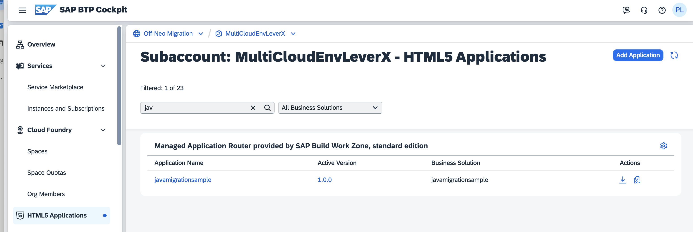

#### Final Configuration
In SAP BTP Neo, the destination from `application1` to `application2` was created with `Authentication: AppToAppSSO`.<br>

SAP BTP Cloud Foundry does not have such a destination's Authentication Type. Instead, we will use `Authentication: OAuth2UserTokenExchange`.<br>


Properties:
- Name: application2-destination
- Type: HTTP
- URL: url of the deployed `migration/application2` (cf-application2 application in SAP BTP CloudFoundry Cockpit)
- Proxy Type: Internet
- Authentication: OAuth2UserTokenExchange
- Client ID: clientid of the deployed `migration/application2` (cf-application2 application)
- Client Secret: clientsecret of the deployed `migration/application2` (cf-application2 application)
- Token Service URL: url of the deployed `migration/application2` (cf-application2 application) + `/oauth/token`

Client ID, Client Secret and Token Service URL can be taken from `cf-app2-xsuaa` service binding. Find it in the Cockpit and click `View Credentials`:


> Important! The Token Service URL is created by adding the XSUAA url and "/oauth/token" part.<br>
> Important! E.g. XSUAA url = https://${some_domain}.hana.ondemand.com<br>
> Important! E.g. Token Service URL = https://${some_domain}.hana.ondemand.com/oauth/token

Useful links:
- [OAuth User Token Exchange Authentication](https://help.sap.com/docs/connectivity/sap-btp-connectivity-cf/oauth-user-token-exchange-authentication)

## Known Issues
No known issues.

## How to obtain support
[Create an issue](https://github.com/SAP-samples/<repository-name>/issues) in this repository if you find a bug or have questions about the content.
 
For additional support, [ask a question in SAP Community](https://answers.sap.com/questions/ask.html).

## Contributing
If you wish to contribute code, offer fixes or improvements, please send a pull request. Due to legal reasons, contributors will be asked to accept a DCO when they create the first pull request to this project. This happens in an automated fashion during the submission process. SAP uses [the standard DCO text of the Linux Foundation](https://developercertificate.org/).

## License
Copyright (c) 2024 SAP SE or an SAP affiliate company. All rights reserved. This project is licensed under the Apache Software License, version 2.0 except as noted otherwise in the [LICENSE](LICENSE) file.
